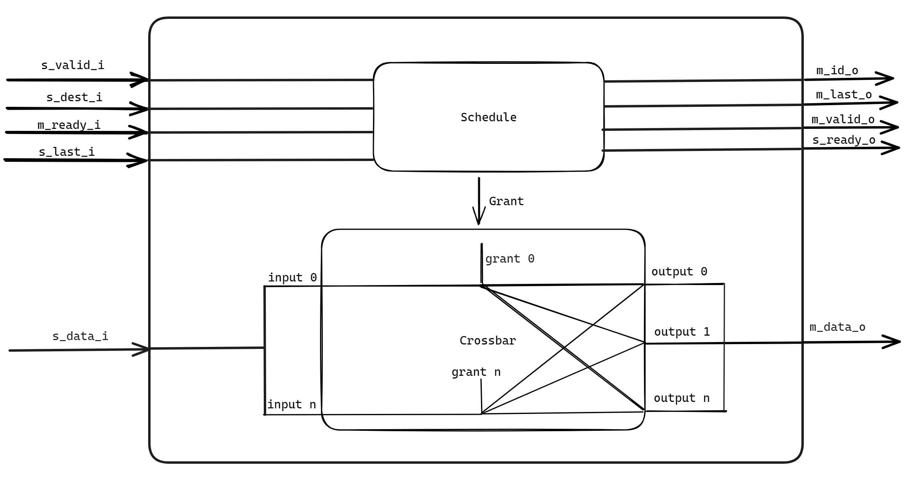

## Потоковый кроссбар NxM на языке Verilog

Для запуска скриптов необходимо чтобы у вас на компьютере в переменной $PATH был путь к бинарным файлам vivado. Еще одним способом запуска скриптов является ручной запуск приложения `Vivado Tcl Shell`, и запуска скриптов командой `-source ./tcl_script/name_of_script.tcl`

## Запуск симулятора
`make sim`

sim_output - директория в которой будет храниться результаты симуляции

### Очистка директории после симуляции
`make clean_sim`

## Синтез проекта  
`make syn`

### Очистка директории после синтеза
`make clean_syn`

syn_output - директория в которой будет храниться результаты синтеза а так же отчеты по времени и потребляемой энергии